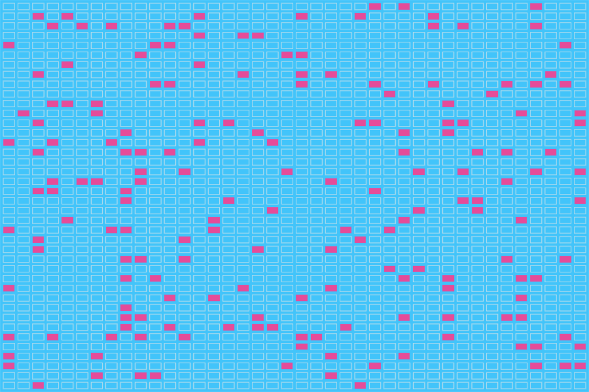

# Life In Love

*A simple simulation, inspired by Conway's Game of Life, and built using Lua and [Love](https://love2d.org/).*

## Useful Resources

For getting started with LOVE: https://love2d.org/wiki/Category:Tutorials

For getting started with Life: https://www.nytimes.com/2020/12/28/science/math-conway-game-of-life.html
